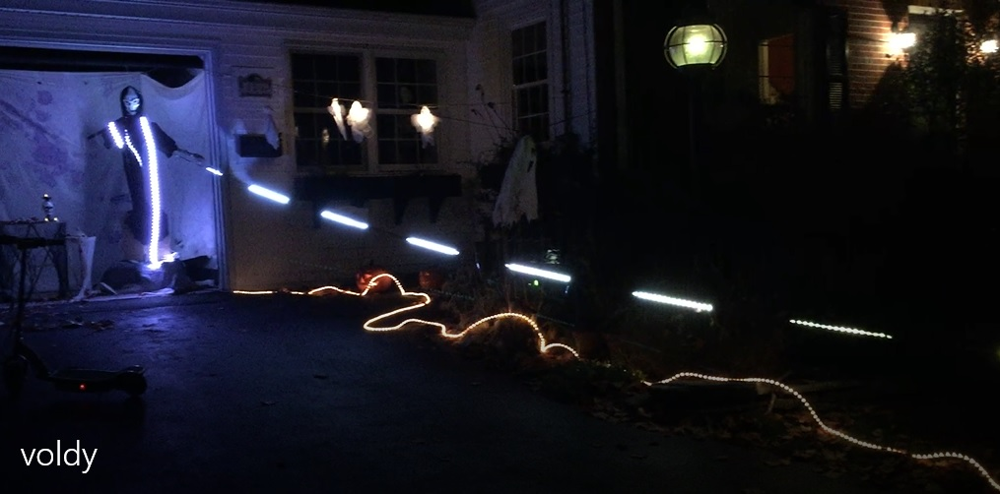
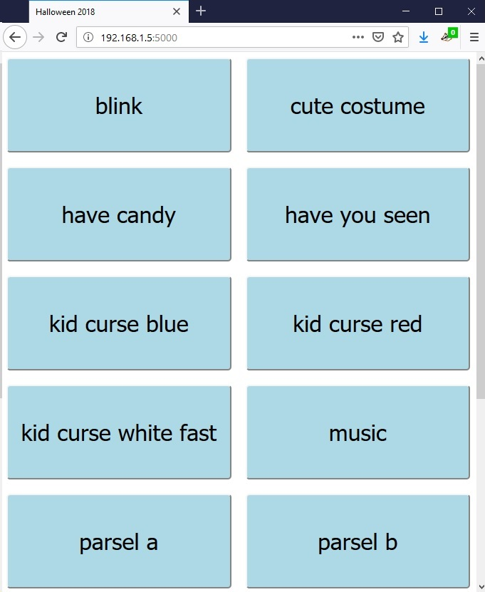
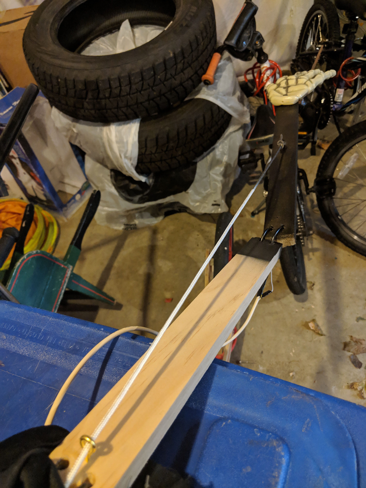
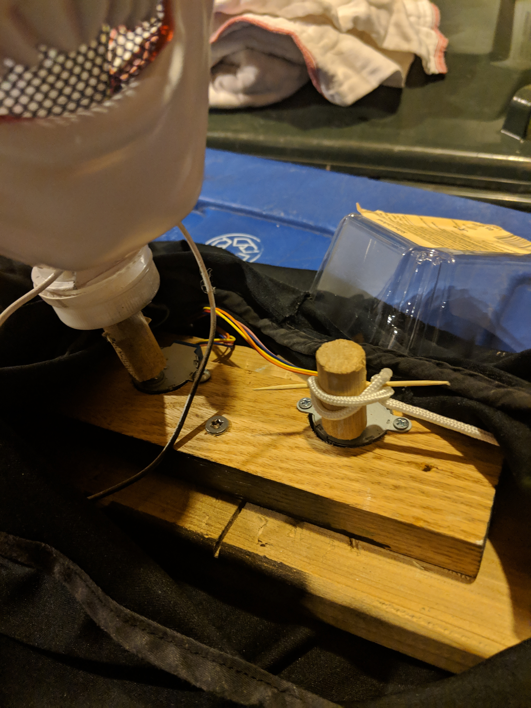

# Halloween 2018

[Video](images/voldy.mov)

## Parts

* 10a 5v power supply
* Rasperry Pi Model 3B for control
  * Line out to my receiver for audio
  * Wifi to a hotspot on my phone for UI
  * UI served using Flask
  * I2C via Pi Cobbler to Arduinos
* Adafruit Bluefruit NRF52 for spell LEDs
  * 2x strands of ~150 NeoPixels
  * One is divided into segments and hung from tie line
  * "Crashed" a few times during the night requiring reset, cause unknown.
* Arduino Uno for stepper motors and eye LEDs
  * 2x cheap stepper motors with driver boards from Amazon
  * A little too slow for animatronics, would try servos next time.
  * Eye LEDs were too weak, next time snip off individual NeoPixels.

